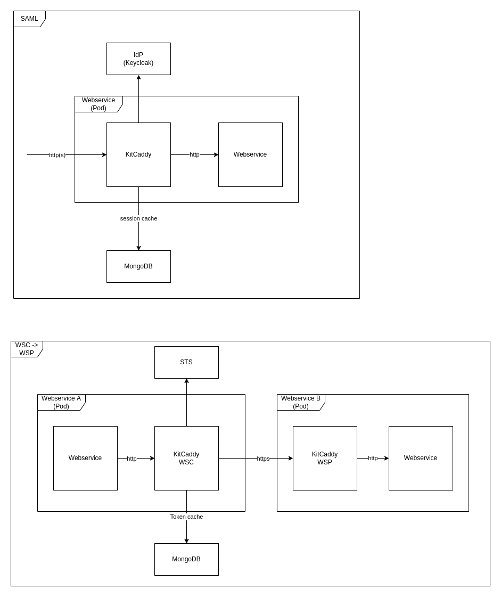
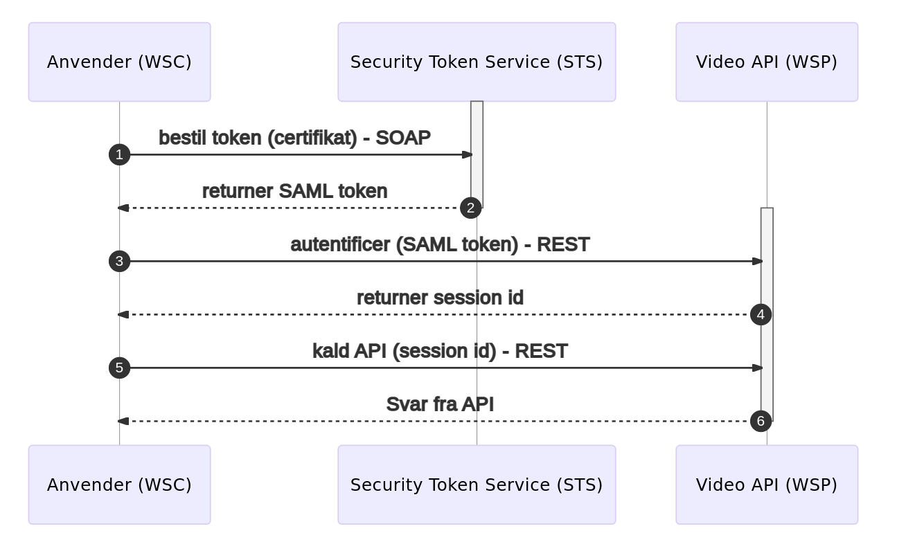

# KitCaddy

KitCaddy is an open source Web Server written in Golang, with a Kit (KvalitetsIT) extension for handlig OIO IDWS REST
security protocol. See more <a href="https://www.digitaliser.dk/resource/3457606">here</a> about OIO IDWS REST. KitCaddy
works as a reverse proxy in front of a webservice, so it can decouple the security protocol from the webservice.



The images show the three configurations possible for KitCaddy; SAML, WSC and WSP. Configuration of KitCaddy is done
with a configuration file or with a Helm Chart.

The Helm Chart is using KitCaddy as a sidecar to the selected webservice. As shown in the image above. See Helm Chart
documentation <a href="https://github.com/KvalitetsIT/kitcaddy/tree/master/helm/kitcaddy">here</a>

If configured by configuration file, KitCaddy expects a configuration file placed at `/config/configmap.yaml`

The flow with WSC and WSP is shown in the flowchart below.


## How to test a STS with KitCaddy as WSC and WSP

A brief introduction to the setup described below: the WSC is the server that request a token from the STS, while the
WSP is the server that validates tokens from the WSC against the public key from the STS, and provides access to a
service if the token is valid. The WSC and WSP must trust the public key from the STS. The STS must trust the clients
that want access to the WSP (in the example provided below, we only have one client, the WSC), and the WSC must trust
the WSP.

More generally, the STS must trust clients (WSC) that want access to the servers (WSP). The clients
and servers must both trust the STS. Beside the STS, the clients must also trust the servers they want access to.

In `/integrationtest/compose-setups/wsc-sts-wsp` a docker `compose.yaml`  file can be found. This will start two
KitCaddy images, one as a WSC and one as a WSP, a database used by the WSC and WSP, and an HTTP echo service.
In the same folder, a `config` folder exists, which contain files to configure the WSC and WSP. These config files are
Caddy JSON configuration structures. For details of the configuration files, look for the JSON configuration structure
documentation on the <a href="https://caddyserver.com/">Caddy website</a>. The necessary trust is set up with the
provided compose and configuration files.

By default, the WSP is configured to forward traffic to the echo service. This can be configured in the WSP config -
look for `"dial": "echo:80"`, and change `echo:80`
accordingly. Replace `TODO` in the WSC config with the URL to the STS. Replace the `stsTODO.cer` in the `compose.yaml`
with the public certificate from the STS, so that the WSC and the WSP can add it to their trusted certificates.

Run the setup with `docker-compose up`, and visit <a href="localhost:8080">localhost:8080</a> in your browser to verify
that the STS correctly pass a token to the WSC and allow access to the service that the WSP is connected to.

The certificate for the KitCaddy WSP must be a SAN certificate, with the DNS.1 attribute set to the lowercase name of
the service (
"kitcaddywsp" when running the WSP using the provided `compose.yaml`). No other DNS attributes are needed.
See <a href="https://fabianlee.org/2018/02/17/ubuntu-creating-a-self-signed-san-certificate-using-openssl/">this</a> for
details. The domain described doesn't matter for the setup run with compose. A `san.cnf` is provided, which can be used
to create a certificate
with `openssl req -x509 -newkey rsa:4096 -keyout key.pem -out certificate.cer -sha256 -days 365 -nodes -config san.cnf -extensions v3_req`
.

## How to run the tests

In order to run the `KitCaddy` tests, first build the `KitCaddy` docker image locally:

```
    docker build -t kvalitetsit/kitcaddy:dev .
```

Then go to `/integrationtest` and run `mvn test`.
